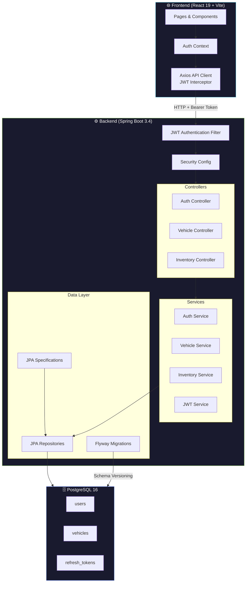

<div align="center">

# 🚗 Car Dealership Inventory System

A full-stack **Luxury Automotive Inventory & Acquisition Platform** built with **Spring Boot** and **React**, featuring JWT authentication, role-based access control, real-time inventory management, advanced vehicle search with **min/max price filtering**, and a bespoke **dark luxury showroom UI** with digital contract signing and escrow simulation.

[](https://openjdk.org/)
[](https://spring.io/projects/spring-boot)
[](https://react.dev/)
[](https://www.postgresql.org/)
[](https://docs.docker.com/compose/)
[](https://swagger.io/)

</div>

---

## ✨ Features

### 🔐 Authentication & Authorization
- **JWT-based authentication** with access tokens (15-min) and refresh tokens (7-day)
- **Refresh token rotation** — each use issues a new token and invalidates the old one
- **Role-based access control** — `USER` and `ADMIN` roles with method-level security
- **BCrypt password encoding** for secure credential storage

### 🚘 Vehicle Management
- **Full CRUD operations** for vehicle inventory (Admin only)
- **Detailed Profiles** — comprehensive specs including VIN, trim, engine, and condition
- **Monroney Sticker Generation** — printable window stickers for physical showrooms
- **Dynamic search** with filters — search by make, model, category, price range
- **Paginated listings** with configurable page size and sorting

### 📦 Inventory Operations
- **Purchase vehicles** — automatically decrements stock with out-of-stock protection
- **Restock vehicles** — Admin-only bulk restocking with validation
- **Optimistic locking** — prevents lost updates during concurrent operations

### 🛡️ Engineering Practices
- **Flyway database migrations** — version-controlled schema management
- **Global exception handling** — consistent API error responses via `@RestControllerAdvice`
- **JPA Specifications** — type-safe dynamic query building for search
- **Java Records** for immutable DTOs — zero boilerplate
- **Testcontainers** for integration testing against a real PostgreSQL instance
- **JaCoCo** code coverage and **Spotless** code formatting (Google Java Format)

---

## 🏗️ Architecture Overview



---

## 🛠️ Tech Stack

| Layer | Technology | Purpose |
|-------|-----------|---------|
| **Backend** | Java 21, Spring Boot 3.4.1 | REST API, business logic, security |
| **Security** | Spring Security, JJWT 0.12.6 | JWT authentication, role-based authorization |
| **Database** | PostgreSQL 16 | Persistent data storage |
| **ORM** | Spring Data JPA (Hibernate) | Object-relational mapping, specifications |
| **Migrations** | Flyway | Version-controlled database schema management |
| **API Docs** | SpringDoc OpenAPI 2.8.6 | Auto-generated Swagger UI |
| **Frontend** | React 19, Vite 8.1 | Single-page application |
| **Styling** | Tailwind CSS 4.3 | Utility-first CSS framework |
| **Forms** | React Hook Form + Zod | Type-safe form validation |
| **HTTP Client** | Axios | API calls with JWT interceptor |
| **Icons** | Lucide React | Modern icon library |
| **Containerization** | Docker Compose | PostgreSQL container management |
| **Backend Testing** | JUnit 5, Mockito, Testcontainers | Unit + integration tests |
| **Frontend Testing** | Vitest, Testing Library, MSW | Component + API mocking tests |
| **Code Quality** | Spotless (Google Java Format), JaCoCo, OxLint | Formatting, coverage, linting |

---

## 🚀 Quick Start

### Prerequisites

- **Java 21** — [Download OpenJDK](https://openjdk.org/)
- **Node.js 18+** — [Download Node.js](https://nodejs.org/)
- **Docker Desktop** — [Download Docker](https://www.docker.com/products/docker-desktop/)
- **Git** — [Download Git](https://git-scm.com/)

### 1. Clone the Repository

```bash
git clone https://github.com/your-username/car-dealership.git
cd car-dealership
```

### 2. Start the Backend

```bash
cd car-dealership-api
./mvnw spring-boot:run
```

> **Note:** The Spring Boot app automatically starts the PostgreSQL Docker container via `spring-boot-docker-compose` integration. No manual `docker compose up` needed.

### 3. Start the Frontend

```bash
cd car-dealership-web
npm install
npm run dev
```

### 4. Open the App

| Resource | URL |
|----------|-----|
| 🖥️ **Frontend (Showroom)** | [http://localhost:5173](http://localhost:5173) |
| 📡 **Backend API** | [http://localhost:8080](http://localhost:8080) |
| 📖 **Swagger UI** | [http://localhost:8080/swagger-ui/index.html](http://localhost:8080/swagger-ui/index.html) |
| 💚 **Health Check** | [http://localhost:8080/actuator/health](http://localhost:8080/actuator/health) |

### Default Credentials

| Role | Email | Password |
|------|-------|----------|
| **Admin** | `admin@dealership.com` | `admin123` |
| **VIP Client** | `client@dealership.com` | `client123` |

> These credentials are seeded automatically by a Flyway repeatable migration on startup.

### Frontend Routes

| Path | Page | Auth |
|------|------|------|
| `/` | Public Showroom | None |
| `/vehicles/:id` | Vehicle Detail | None |
| `/login` | Login | None |
| `/register` | Register | None |
| `/dashboard` | Inventory Dashboard (with SearchBar + min/max price) | 🔒 User |
| `/profile` | Client Dossier (acquisition history & contracts) | 🔒 User |
| `/admin/inventory` | Admin Inventory Management | 🔒 Admin |

---

## 📡 API Endpoints

### Authentication (`/api/auth`)

| Method | Endpoint | Auth | Description |
|--------|----------|------|-------------|
| `POST` | `/api/auth/register` | Public | Register a new user |
| `POST` | `/api/auth/login` | Public | Login and receive JWT tokens |
| `POST` | `/api/auth/refresh` | Public | Refresh expired access token |
| `POST` | `/api/auth/logout` | 🔒 User | Invalidate refresh tokens |

### Vehicles (`/api/vehicles`)

| Method | Endpoint | Auth | Description |
|--------|----------|------|-------------|
| `GET` | `/api/vehicles` | Public | List vehicles (paginated) |
| `GET` | `/api/vehicles/{id}` | Public | Get vehicle by ID |
| `GET` | `/api/vehicles/search` | Public | Search with filters |
| `POST` | `/api/vehicles` | 🔒 Admin | Create a vehicle |
| `PUT` | `/api/vehicles/{id}` | 🔒 Admin | Update a vehicle |
| `DELETE` | `/api/vehicles/{id}` | 🔒 Admin | Delete a vehicle |

### Inventory (`/api/vehicles/{id}`)

| Method | Endpoint | Auth | Description |
|--------|----------|------|-------------|
| `POST` | `/api/vehicles/{id}/purchase` | 🔒 User | Purchase (decrement stock) |
| `POST` | `/api/vehicles/{id}/restock` | 🔒 Admin | Restock (increment stock) |

> 📄 For detailed request/response examples, see [API Documentation](docs/API_DOCUMENTATION.md).

---

## 📁 Project Structure

```
car-dealership/
│
├── car-dealership-api/                  # ⚙️ Spring Boot Backend
│   ├── pom.xml                          # Maven dependencies
│   └── src/main/java/com/dealership/
│       ├── config/                      # CORS, OpenAPI, Logging configs
│       ├── controller/                  # REST controllers (Auth, Vehicle, Inventory)
│       ├── entity/                      # JPA entities (User, Vehicle, RefreshToken)
│       ├── exception/                   # Global exception handler + custom exceptions
│       ├── repository/                  # Spring Data JPA repositories
│       ├── security/                    # Security config, JWT filter, auth provider
│       ├── service/                     # Business logic layer
│       └── vehicle/                     # Vehicle mapper, specifications, DTOs
│
├── car-dealership-web/                  # 🌐 React Frontend (Dark Luxury Theme)
│   └── src/
│       ├── api/                         # Axios client with JWT interceptor
│       ├── components/                  # Reusable UI components
│       │   ├── inventory/               # VehicleCard, VehicleForm, SearchBar,
│       │   │                            #   PurchaseAgreementModal, FinanceCalculator
│       │   ├── layout/                  # Navbar, MainLayout, AuthLayout
│       │   └── ui/                      # Button, Input, Modal (headless dark), Toast
│       ├── context/                     # Auth context (global state)
│       ├── hooks/                       # Custom hooks (useVehicles, useDebounce)
│       ├── pages/                       # Login, Register, Dashboard, Showroom,
│       │                                #   VehicleDetail, ClientProfile (Dossier)
│       └── routes/                      # App routes, protected routes, admin guards
│
├── docker-compose.yml                   # 🐳 PostgreSQL container
└── docs/                                # 📄 Documentation
    ├── ARCHITECTURE.md                  # System design & architecture
    ├── API_DOCUMENTATION.md             # Complete API reference
    ├── DATABASE_DESIGN.md               # Database schema & design
    └── SETUP_GUIDE.md                   # Developer onboarding guide
```

---

## 🧪 Running Tests

### Backend Tests

```bash
cd car-dealership-api
./mvnw test
```

> Runs **Unit Tests (JUnit 5 + Mockito)** for isolated business logic testing, and **Integration Tests (Testcontainers)** which spin up a real PostgreSQL instance to test the database layer.

### Frontend Tests

```bash
cd car-dealership-web
npm test
```

### Code Quality

```bash
# Format Java code (Google Java Format)
cd car-dealership-api
./mvnw spotless:apply

# Lint frontend code
cd car-dealership-web
npx oxlint
```

---

## 📚 Documentation

| Document | Description |
|----------|-------------|
| [Architecture](docs/ARCHITECTURE.md) | System design, security flows, design decisions |
| [API Documentation](docs/API_DOCUMENTATION.md) | Complete API reference with examples |
| [Database Design](docs/DATABASE_DESIGN.md) | ER diagrams, schema, indexing strategy |
| [Setup Guide](docs/SETUP_GUIDE.md) | Developer onboarding & troubleshooting |

---

## 📄 License

This project is built for Online Assesment Round for Incubyte. And i Wish they Like my Projects and My Design.

---

<div align="center">

**Built with ❤️ using Spring Boot & React**

</div>
