# 🏗️ System Architecture — Car Dealership Inventory System

> A full-stack inventory management platform built with **Spring Boot 3**, **React 19**, and **PostgreSQL 16**.
> This document captures the architectural decisions, security design, and trade-offs behind the system.

---

## Table of Contents

1. [High-Level Architecture](#1-high-level-architecture)
2. [Layered Architecture](#2-layered-architecture)
3. [Security Architecture](#3-security-architecture)
4. [Database Design](#4-database-design)
5. [Key Design Decisions](#5-key-design-decisions)
6. [Error Handling Strategy](#6-error-handling-strategy)
7. [Package Structure Philosophy](#7-package-structure-philosophy)
8. [Frontend Architecture](#8-frontend-architecture)
9. [Testing Strategy](#9-testing-strategy)
10. [DevOps & Tooling](#10-devops--tooling)
11. [Lessons Learned / What I'd Do Differently](#11-lessons-learned--what-id-do-differently)

---

## 1. High-Level Architecture

The system follows a classic **three-tier architecture** with a clear separation between the client, the API server, and the data store.

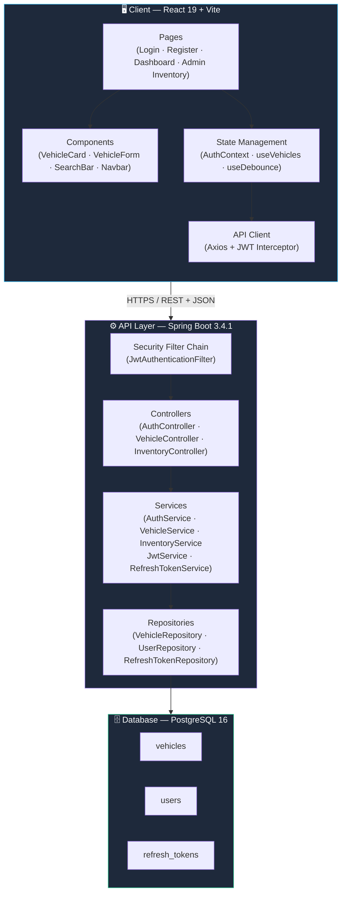

### Request Lifecycle (Simplified)

```
React UI → Axios (attach JWT) → Spring Security Filter → Controller → Service → Repository → PostgreSQL
                                        ↓ (on failure)
                              GlobalExceptionHandler → Consistent Error JSON
```

---

## 2. Layered Architecture

The backend is organized into four logical layers. Each layer has a single responsibility and communicates only with its immediate neighbor.

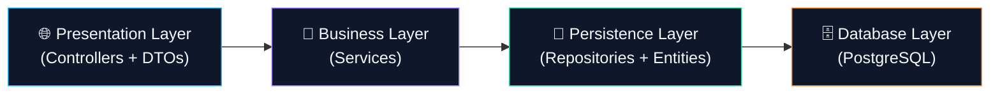

| Layer | Responsibility | Key Classes |
|---|---|---|
| **Presentation** | Accept HTTP requests, validate input, serialize responses | `AuthController`, `VehicleController`, `InventoryController`, DTOs (`VehicleRequest`, `VehicleResponse`, `LoginRequest`, etc.) |
| **Business** | Enforce business rules, orchestrate operations | `AuthService`, `VehicleService`, `InventoryService`, `JwtService`, `RefreshTokenService` |
| **Persistence** | Data access, query construction, entity mapping | `VehicleRepository`, `UserRepository`, `RefreshTokenRepository`, `VehicleSpecification` |
| **Database** | Store and retrieve data | PostgreSQL 16, managed via Flyway migrations |

### Why This Pattern?

- **Testability** — Each layer can be tested in isolation. Services are tested with mocked repositories; controllers are tested with mocked services.
- **Separation of Concerns** — A change in how vehicles are queried (e.g., switching from JPA to jOOQ) affects only the persistence layer.
- **Onboarding Speed** — Any developer familiar with Spring conventions can navigate the codebase immediately.

---

## 3. Security Architecture

### 3.1 Overview

The system uses **stateless JWT-based authentication** with a **refresh token rotation** scheme. There are no server-side sessions — every authenticated request carries a self-contained access token.

| Aspect | Implementation |
|---|---|
| Access Token | JWT, HMAC-SHA signed, 15-minute expiry, includes `roles` claim |
| Refresh Token | Opaque UUID, 7-day expiry, stored in `refresh_tokens` table, rotated on use |
| Password Storage | BCrypt hashing |
| Session Management | Stateless (`SessionCreationPolicy.STATELESS`), CSRF disabled |
| Authorization Model | Role-based — `USER` and `ADMIN` roles |
| Method Security | `@EnableMethodSecurity` + `@PreAuthorize` annotations |

### 3.2 Access Control Rules

```java
// SecurityConfig — Spring Security Filter Chain
/api/auth/**          → permitAll()       // Login, register, refresh
GET /api/vehicles/**  → permitAll()       // Public vehicle browsing
POST/PUT/DELETE /**   → authenticated()   // All mutations require auth
Admin endpoints       → @PreAuthorize("hasRole('ADMIN')")
```

### 3.3 Login & Token Issuance Flow

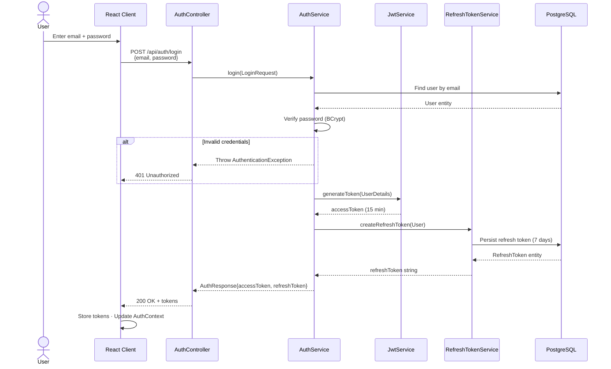

### 3.4 Authenticated Request Flow

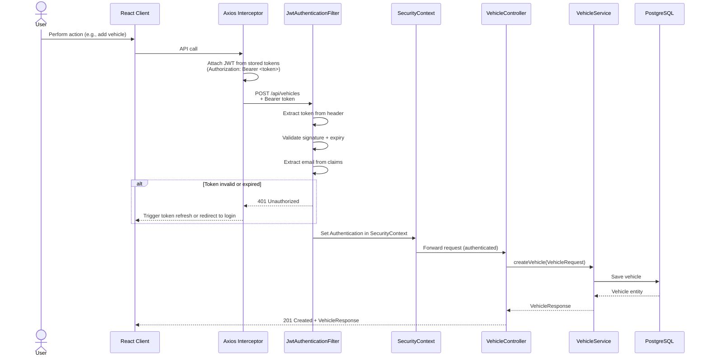

### 3.5 Token Refresh & Rotation Flow

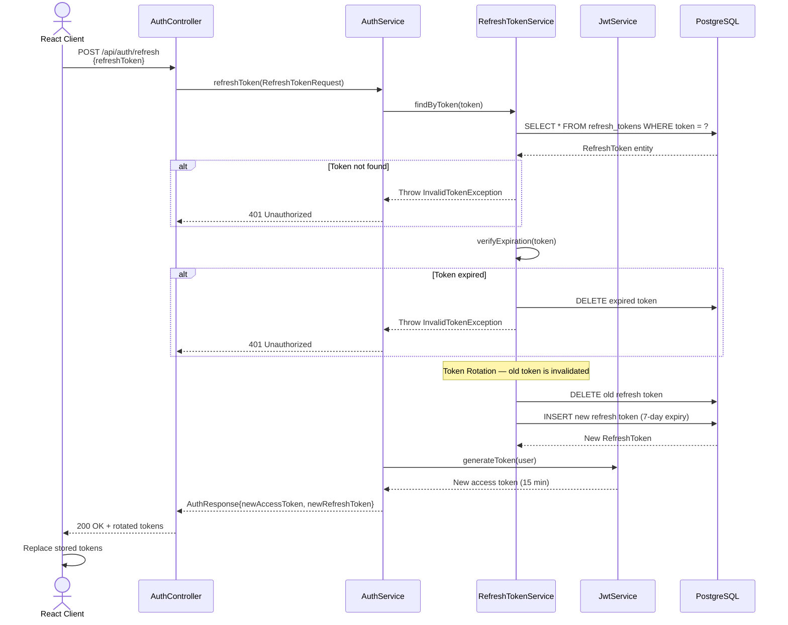

> [!IMPORTANT]
> **Why rotate refresh tokens?** If a refresh token is compromised, the attacker can only use it once. The next legitimate refresh by the real user will fail (token already consumed), alerting the system to a potential breach. This is called **refresh token rotation** and is recommended by the [OAuth 2.0 Security Best Current Practice (RFC 9700)](https://datatracker.ietf.org/doc/html/rfc9700).

---

## 4. Database Design

### 4.1 Entity-Relationship Diagram

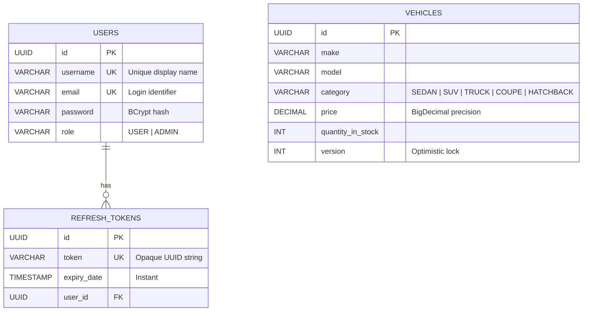

### 4.2 Key Schema Decisions

| Decision | Rationale |
|---|---|
| UUID primary keys | Avoids sequential ID enumeration attacks; safe for distributed systems |
| `@Version` on `Vehicle` | Enables optimistic locking — prevents lost updates during concurrent purchases |
| `ON DELETE CASCADE` on `refresh_tokens.user_id` | Automatically clean up tokens when a user is deleted |
| `email` as the login identifier | `UserDetails.getUsername()` returns `email`, not the display `username` |
| Flyway migrations | Version-controlled, repeatable schema changes — no manual DDL |

---

## 5. Key Design Decisions

| # | Decision | Choice | Why / Trade-off |
|---|---|---|---|
| 1 | **Auth Mechanism** | JWT (access) + Opaque (refresh) | Stateless API scaling. Trade-off: cannot revoke access tokens before expiry — mitigated by short (15 min) TTL |
| 2 | **Concurrency Control** | Optimistic Locking (`@Version`) | Low-contention inventory. If two users purchase simultaneously, one gets an `OptimisticLockException`. Better throughput than pessimistic locking for read-heavy workloads |
| 3 | **Search Implementation** | JPA Specifications (`JpaSpecificationExecutor`) | Dynamic, type-safe query building. `VehicleSpecification` composes predicates for make, model, category, and price range without string concatenation or native SQL |
| 4 | **DTO Strategy** | Java Records | Immutable, concise, no boilerplate. Records provide `equals()`, `hashCode()`, and `toString()` for free. One-way mapping via `VehicleMapper` |
| 5 | **Database Migrations** | Flyway | SQL-based, version-controlled migrations. Explicit control over schema evolution vs. Hibernate `ddl-auto` which is unsafe for production |
| 6 | **Frontend State** | React Context (`AuthContext`) | Auth state is global but simple (user + tokens). No need for Redux — Context avoids prop drilling without the ceremony of a state management library |
| 7 | **Error Handling** | `@RestControllerAdvice` (`GlobalExceptionHandler`) | Single place to catch exceptions and return consistent JSON error responses. Prevents stack traces from leaking to clients |
| 8 | **API Documentation** | SpringDoc OpenAPI (Swagger UI) | Auto-generated from annotations; always in sync with code. Useful for frontend developers and interview demos |
| 9 | **Code Formatting** | Spotless + Google Java Format | Enforced consistent style across the codebase, eliminates formatting debates in code reviews |
| 10 | **Frontend Validation** | React Hook Form + Zod | Schema-based validation co-located with forms. Zod schemas are composable and type-safe |

---

## 6. Error Handling Strategy

All exceptions are caught and transformed into consistent JSON responses by a single `@RestControllerAdvice` class: `GlobalExceptionHandler`.

### 6.1 Error Response Format

```json
{
  "timestamp": "2026-07-12T07:30:00Z",
  "status": 404,
  "error": "Not Found",
  "message": "Vehicle not found with id: 550e8400-e29b-41d4-a716-446655440000",
  "path": "/api/vehicles/550e8400-e29b-41d4-a716-446655440000"
}
```

### 6.2 Exception Mapping

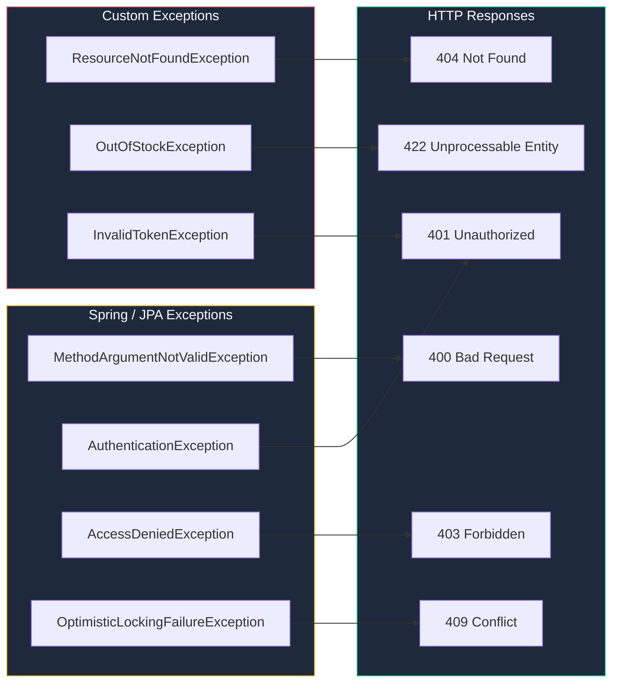

| Exception | HTTP Status | When It's Thrown |
|---|---|---|
| `ResourceNotFoundException` | 404 | Vehicle or user not found by ID |
| `OutOfStockException` | 422 | Purchase attempted when `quantityInStock == 0` |
| `InvalidTokenException` | 401 | Refresh token is expired, missing, or already consumed |
| `MethodArgumentNotValidException` | 400 | Request body fails `@Valid` / Bean Validation constraints |
| `AuthenticationException` | 401 | Invalid email/password at login |
| `AccessDeniedException` | 403 | User lacks the required role (e.g., `USER` trying admin endpoints) |
| `OptimisticLockingFailureException` | 409 | Concurrent modification detected on a vehicle entity |

> [!NOTE]
> The `GlobalExceptionHandler` ensures that **no raw stack traces** ever reach the client. Every error — expected or unexpected — is wrapped in the standard response format above.

---

## 7. Package Structure Philosophy

The project uses a **hybrid feature-based + layer-based** package organization:

```
com.dealership/
│
├── auth/dto/              ← Feature: Authentication (DTOs grouped with feature)
│
├── config/                ← Cross-cutting: Configuration
├── controller/            ← Layer: Presentation
├── entity/                ← Layer: Domain model
├── exception/             ← Cross-cutting: Error handling
├── repository/            ← Layer: Data access
├── security/              ← Feature: Security infrastructure
├── service/               ← Layer: Business logic
│
└── vehicle/               ← Feature: Vehicle domain
    ├── VehicleMapper.java
    ├── VehicleSpecification.java
    └── dto/
        ├── VehicleRequest.java
        ├── VehicleResponse.java
        ├── VehicleSearchCriteria.java
        └── RestockRequest.java
```

### Why Hybrid?

| Approach | Strength | Weakness |
|---|---|---|
| Pure layer-based (`controller/`, `service/`, `repository/`) | Familiar to Spring developers | DTOs and mappers for different domains get mixed together |
| Pure feature-based (`vehicle/`, `auth/`) | High cohesion within a feature | Can feel over-engineered for small features |
| **Hybrid (this project)** | Core layers remain conventional; complex domains (`vehicle`, `auth`) get their own sub-packages | Slightly less consistent — but pragmatically the right call |

The `vehicle/` feature package bundles its DTOs, mapper, and specification together because they are tightly coupled to the vehicle domain. The `auth/dto/` sub-package keeps authentication DTOs close to their feature. Meanwhile, controllers and services that are simple enough remain in the top-level layer packages.

> [!TIP]
> **Interview talking point:** _"I started with a pure layered structure. As the vehicle domain grew (search criteria, mapper, multiple DTOs), I extracted it into a feature package to keep related code together. This is a pragmatic evolution — I didn't force a pattern; I let the code tell me when it was time to refactor."_

---

## 8. Frontend Architecture

### 8.1 Component Hierarchy

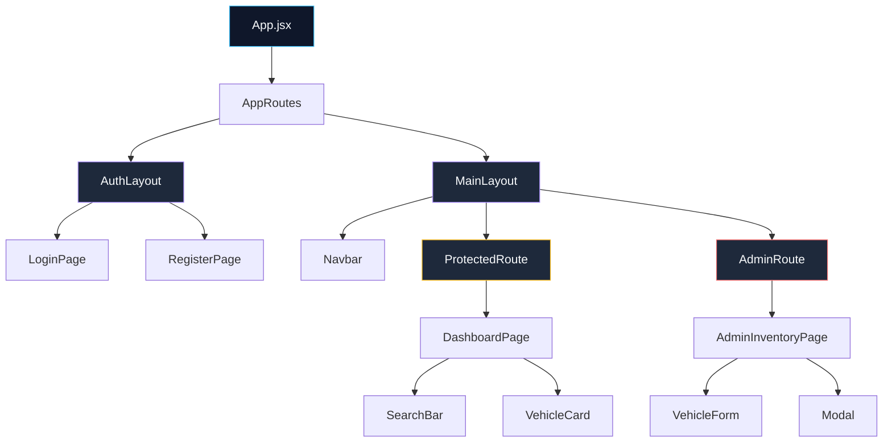

### 8.2 State Management

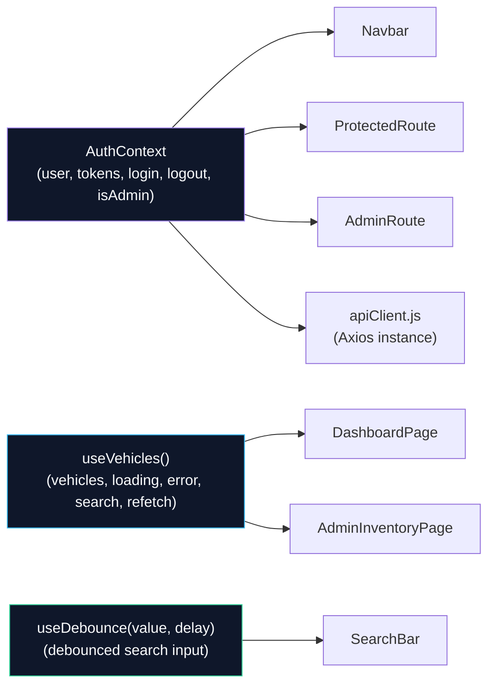

**Why React Context over Redux?**

The application has a single global concern: **authentication state** (current user, tokens, roles). React Context handles this cleanly without the boilerplate of Redux (actions, reducers, store configuration). Vehicle data is local to the pages that need it — fetched via `useVehicles()` and not shared globally.

### 8.3 API Client Pattern

```javascript
// apiClient.js — Simplified
const apiClient = axios.create({ baseURL: '/api' });

// Request interceptor — attach JWT to every outgoing request
apiClient.interceptors.request.use((config) => {
  const token = getStoredAccessToken();
  if (token) {
    config.headers.Authorization = `Bearer ${token}`;
  }
  return config;
});
```

The Axios interceptor is the **single point of responsibility** for attaching authentication headers. Individual API call sites (`vehicleApi.js`) never deal with tokens — they simply call `apiClient.get('/vehicles')`.

### 8.4 Route Guards

| Guard | Purpose | Redirect |
|---|---|---|
| `ProtectedRoute` | Ensures user is logged in | → `/login` |
| `AdminRoute` | Ensures user has `ADMIN` role | → `/dashboard` (or 403 page) |

Both guards read from `AuthContext` and use `jwt-decode` to verify the token's validity and role claims before rendering child routes.

---

## 9. Testing Strategy

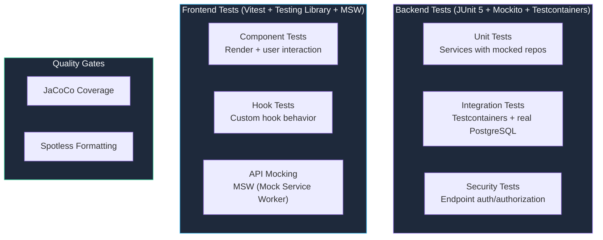

| Layer | Tool | What's Tested |
|---|---|---|
| **Service Layer** | JUnit 5 + Mockito | Business logic in isolation — `VehicleService`, `AuthService`, `InventoryService` |
| **Repository Layer** | Testcontainers (PostgreSQL) | JPA queries, specifications, and Flyway migrations against a real database |
| **Controller Layer** | `@WebMvcTest` + MockMvc | Request/response serialization, validation, security rules |
| **Frontend Components** | Vitest + Testing Library | User interactions, form validation, conditional rendering |
| **API Integration** | MSW (Mock Service Worker) | Intercepting network requests at the service worker level — no mock axios |

> [!TIP]
> **Testcontainers** ensures integration tests run against an actual PostgreSQL 16 instance (spun up as a Docker container), not H2 or an in-memory substitute. This eliminates "works on H2 but breaks on Postgres" bugs.

---

## 10. DevOps & Tooling

### 10.1 Development Environment

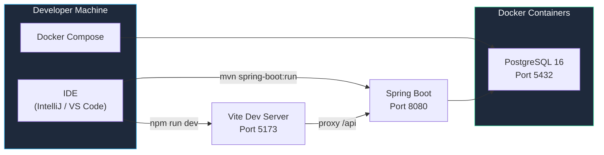

### 10.2 Tool Chain

| Tool | Purpose |
|---|---|
| **Docker Compose** | Single command to spin up PostgreSQL |
| **Flyway** | Versioned, SQL-based database migrations |
| **JaCoCo** | Code coverage reporting for backend |
| **Spotless** | Enforce Google Java Format — fail build on violations |
| **SpringDoc OpenAPI** | Auto-generate Swagger UI at `/swagger-ui.html` |
| **Vite** | Lightning-fast HMR for frontend development |

---

## 11. Lessons Learned / What I'd Do Differently

> [!NOTE]
> These reflections demonstrate growth mindset and architectural awareness — exactly what interviewers look for.

### 1. Externalize the JWT Secret

**Current state:** The JWT signing key is stored in `application.properties` / `application.yml`.

**What I'd change:** Use a proper secret management solution like **HashiCorp Vault**, **AWS Secrets Manager**, or at minimum **environment variables** injected at deployment time. Hardcoded secrets are a security anti-pattern — they end up in version control and are difficult to rotate.

### 2. Add Rate Limiting

**Current state:** No rate limiting on any endpoint.

**What I'd change:** Implement rate limiting on `/api/auth/login` and `/api/auth/refresh` using **Bucket4j** or **Resilience4j**. Without rate limiting, the login endpoint is vulnerable to brute-force attacks. A sliding window of ~5 requests per minute per IP would be a reasonable starting point.

### 3. Event-Driven Purchase Notifications

**Current state:** The `InventoryService.purchase()` method synchronously decrements stock and returns.

**What I'd change:** Publish a `VehiclePurchasedEvent` using **Spring Application Events** (or a message broker like **RabbitMQ** for a distributed setup). Downstream listeners could handle notifications (email/SMS), analytics, and low-stock alerts — all decoupled from the purchase transaction.

```java
// Hypothetical improvement
applicationEventPublisher.publishEvent(
    new VehiclePurchasedEvent(vehicle.getId(), remainingStock)
);
```

### 4. Request/Response Logging & Observability

**Current state:** Basic `RequestLoggingConfig` exists, but there's no structured logging or distributed tracing.

**What I'd change:** Integrate **Micrometer + Prometheus** for metrics and **Spring Boot Actuator** for health checks. Add a **correlation ID** to every request (via a servlet filter) so logs can be traced end-to-end. In production, ship logs to an ELK stack or Grafana Loki.

### 5. Consider CQRS for the Vehicle Search

**Current state:** The same `VehicleRepository` handles both writes (CRUD) and reads (dynamic search via Specifications).

**What I'd change:** For a larger-scale system, I'd separate the **read model** (optimized for search — possibly backed by Elasticsearch) from the **write model** (JPA + PostgreSQL). This is the **CQRS** pattern. It's overkill for this project, but it's the natural evolution if search complexity or read throughput becomes a bottleneck.

---

## Quick Reference — Tech Stack

| Layer | Technology | Version |
|---|---|---|
| Language | Java | 21 |
| Backend Framework | Spring Boot | 3.4.1 |
| ORM | Spring Data JPA (Hibernate) | — |
| Security | Spring Security + JJWT | 0.12.6 |
| Database | PostgreSQL | 16 |
| Migrations | Flyway | — |
| API Docs | SpringDoc OpenAPI | — |
| Frontend Framework | React | 19 |
| Build Tool | Vite | — |
| CSS | Tailwind CSS | — |
| HTTP Client | Axios | — |
| Form Handling | React Hook Form + Zod | — |
| Backend Testing | JUnit 5, Mockito, Testcontainers | — |
| Frontend Testing | Vitest, Testing Library, MSW | — |
| Code Quality | JaCoCo, Spotless (Google Java Format) | — |
| Containerization | Docker Compose | — |

---

> _This document is maintained alongside the codebase and reflects the architecture as of July 2026._
