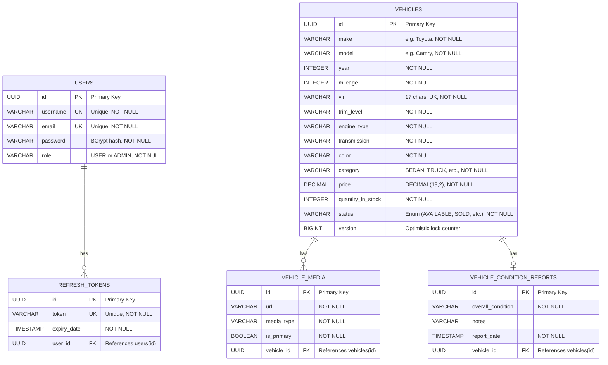
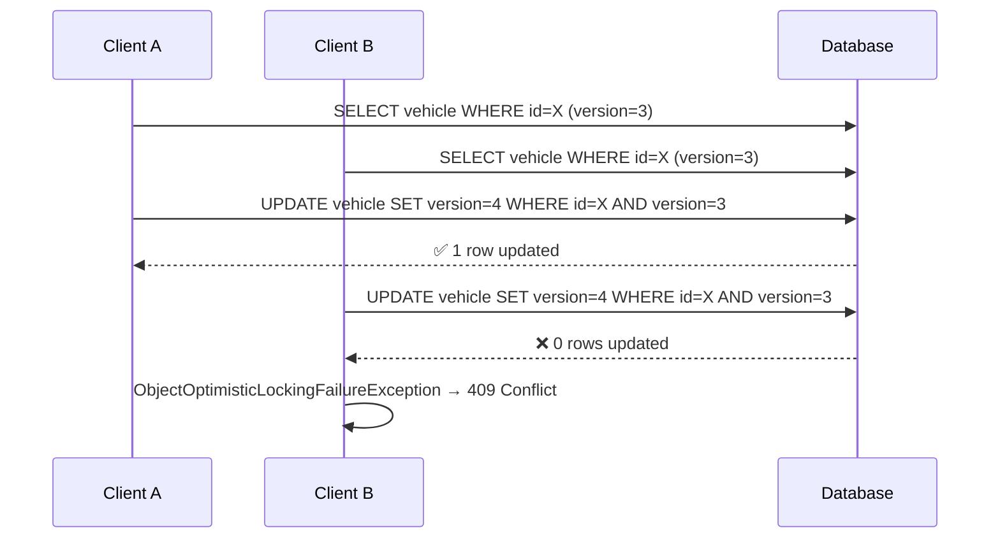

# Database Design Document

## Car Dealership Inventory System — PostgreSQL 16

---

## Table of Contents

1. [Overview](#1-overview)
2. [Entity-Relationship Diagram](#2-entity-relationship-diagram)
3. [Table Definitions](#3-table-definitions)
4. [Indexing Strategy](#4-indexing-strategy)
5. [Referential Integrity](#5-referential-integrity)
6. [Concurrency Control](#6-concurrency-control)
7. [Migration Strategy](#7-migration-strategy)
8. [Data Types Rationale](#8-data-types-rationale)
9. [Normalization](#9-normalization)
10. [Seed Data](#10-seed-data)

---

## 1. Overview

The Car Dealership Inventory System uses a **PostgreSQL 16** relational database designed around three core principles:

- **Simplicity** — A minimal, well-normalized schema that directly models the business domain: vehicles for sale, users who manage them, and authentication tokens for secure session handling.
- **Data Integrity** — Referential integrity via foreign keys, optimistic locking for concurrent access, and unique constraints to prevent duplicate records.
- **Evolvability** — Schema changes are managed through **Flyway** versioned migrations, ensuring reproducible, auditable, and rollback-safe database evolution across all environments.

The schema consists of three tables — `vehicles`, `users`, and `refresh_tokens` — kept deliberately lean to avoid premature abstraction while supporting all current business operations: inventory browsing, vehicle CRUD, user authentication, and role-based access control.

---

## 2. Entity-Relationship Diagram



**Cardinality:**

| Relationship | Cardinality | Description |
|---|---|---|
| `USERS` → `REFRESH_TOKENS` | One-to-Many | A user can have zero or more active refresh tokens (e.g., multiple devices). Each refresh token belongs to exactly one user. |
| `VEHICLES` | Standalone | Vehicles are independent entities with no foreign key relationships. They represent inventory items managed by admin users through the application layer. |

---

## 3. Table Definitions

### 3.1 `vehicles`

Stores the dealership's vehicle inventory. Each row represents a vehicle listing with its pricing and stock level.

| Column | Data Type | Constraints | Description |
|---|---|---|---|
| `id` | `UUID` | `PRIMARY KEY` | Unique identifier for the vehicle, generated at the application layer. |
| `make` | `VARCHAR(255)` | `NOT NULL` | Manufacturer name (e.g., Toyota, Honda, Ford). |
| `model` | `VARCHAR(255)` | `NOT NULL` | Model name (e.g., Camry, Civic, F-150). |
| `year` | `INTEGER` | `NOT NULL` | Manufacture year. |
| `mileage` | `INTEGER` | `NOT NULL` | Mileage on the odometer. |
| `vin` | `VARCHAR(17)` | `UNIQUE`, `NOT NULL` | 17-character Vehicle Identification Number. |
| `trim_level` | `VARCHAR(255)` | `NOT NULL` | Trim level (e.g., LE, XLE). |
| `engine_type` | `VARCHAR(255)` | `NOT NULL` | Engine specifications (e.g., 2.5L 4-Cylinder). |
| `transmission` | `VARCHAR(255)` | `NOT NULL` | Transmission type (e.g., 8-Speed Automatic). |
| `color` | `VARCHAR(255)` | `NOT NULL` | Exterior color. |
| `category` | `VARCHAR(255)` | `NOT NULL` | Vehicle category. Maps to the `Category` enum. |
| `price` | `DECIMAL(19, 2)` | `NOT NULL` | Listing price in USD. Two decimal places for cent-level precision. |
| `quantity_in_stock` | `INTEGER` | `NOT NULL` | Number of units currently available. |
| `status` | `VARCHAR(255)` | `NOT NULL` | Inventory status mapped to `VehicleStatus` enum (AVAILABLE, IN_TRANSIT, MAINTENANCE, RESERVED, SOLD). |
| `version` | `BIGINT` | `NOT NULL` | Optimistic locking version counter. Automatically incremented by JPA on each update. |

**Keys:**
- **Primary Key:** `id`
- **Unique Constraints:** `vin`

**JPA Indexes (defined via `@Table` annotations):**
- `idx_vehicle_make` on `make`
- `idx_vehicle_category` on `category`
- `idx_vehicle_price` on `price`
- `idx_vehicle_status` on `status`

---

### 3.2 `users`

Stores registered user accounts. Implements Spring Security's `UserDetails` contract at the entity level.

| Column | Data Type | Constraints | Description |
|---|---|---|---|
| `id` | `UUID` | `PRIMARY KEY` | Unique identifier for the user. |
| `username` | `VARCHAR(255)` | `UNIQUE`, `NOT NULL` | Display name. Must be unique across the system. |
| `email` | `VARCHAR(255)` | `UNIQUE`, `NOT NULL` | Email address. Used as the Spring Security principal (`getUsername()` returns this field). |
| `password` | `VARCHAR(255)` | `NOT NULL` | BCrypt-encoded password hash. Never stored or transmitted in plaintext. |
| `role` | `VARCHAR(50)` | `NOT NULL` | Authorization role. Maps to the `Role` enum: `USER` or `ADMIN`. Stored as a string for enum flexibility. |

**Keys:**
- **Primary Key:** `id`
- **Unique Constraints:** `username`, `email`

**Implicit Indexes (created by unique constraints):**
- Unique index on `username`
- Unique index on `email`

> [!IMPORTANT]
> The `getUsername()` method on the `User` entity returns the `email` field, not the `username` field. This is because Spring Security uses `getUsername()` to identify the principal, and the system authenticates users by email.

---

### 3.3 `refresh_tokens`

Stores JWT refresh tokens for session management. Enables token rotation and multi-device support.

| Column | Data Type | Constraints | Description |
|---|---|---|---|
| `id` | `UUID` | `PRIMARY KEY` | Unique identifier for the refresh token record. |
| `token` | `VARCHAR(255)` | `UNIQUE`, `NOT NULL` | The refresh token string. Uniqueness ensures no token collision. |
| `expiry_date` | `TIMESTAMP` | `NOT NULL` | Expiration timestamp. Tokens past this date are considered invalid. |
| `user_id` | `UUID` | `NOT NULL`, `FOREIGN KEY` | References `users(id)`. Cascading delete ensures cleanup on user removal. |

**Keys:**
- **Primary Key:** `id`
- **Foreign Key:** `user_id` → `users(id)` with `ON DELETE CASCADE`
- **Unique Constraint:** `token`

**Implicit Indexes:**
- Unique index on `token`

---

### 3.4 `vehicle_media`

Stores media (images, videos) associated with vehicles.

| Column | Data Type | Constraints | Description |
|---|---|---|---|
| `id` | `UUID` | `PRIMARY KEY` | Unique identifier for the media record. |
| `url` | `VARCHAR(255)` | `NOT NULL` | URL pointing to the media resource. |
| `media_type` | `VARCHAR(50)` | `NOT NULL` | Type of media (e.g., IMAGE, VIDEO). |
| `is_primary` | `BOOLEAN` | `NOT NULL` | Indicates if this is the primary image for the vehicle. |
| `vehicle_id` | `UUID` | `NOT NULL`, `FOREIGN KEY` | References `vehicles(id)`. |

**Keys:**
- **Primary Key:** `id`
- **Foreign Key:** `vehicle_id` → `vehicles(id)` with `ON DELETE CASCADE`

---

### 3.5 `vehicle_condition_reports`

Stores the latest condition report for a vehicle.

| Column | Data Type | Constraints | Description |
|---|---|---|---|
| `id` | `UUID` | `PRIMARY KEY` | Unique identifier for the report. |
| `overall_condition` | `VARCHAR(50)` | `NOT NULL` | Overall condition rating (e.g., EXCELLENT, GOOD, FAIR, POOR). |
| `notes` | `TEXT` | | Detailed notes about the vehicle's condition. |
| `report_date` | `TIMESTAMP` | `NOT NULL` | Date when the report was generated. |
| `vehicle_id` | `UUID` | `UNIQUE`, `NOT NULL`, `FOREIGN KEY` | References `vehicles(id)`. |

**Keys:**
- **Primary Key:** `id`
- **Foreign Key:** `vehicle_id` → `vehicles(id)` with `ON DELETE CASCADE`
- **Unique Constraint:** `vehicle_id` (Ensures One-to-One relationship)

---

## 4. Indexing Strategy

| Index | Table | Column(s) | Type | Rationale |
|---|---|---|---|---|
| `PK (id)` | All tables | `id` | Primary Key (B-tree) | Automatic index on primary key. Supports fast lookups by ID. |
| `idx_vehicle_make` | `vehicles` | `make` | Non-unique B-tree | Supports filtering vehicles by manufacturer (e.g., "show all Toyotas"). High-frequency query in the inventory search API. |
| `idx_vehicle_category` | `vehicles` | `category` | Non-unique B-tree | Supports filtering by vehicle type (e.g., "show all SUVs"). Category is a primary facet in the vehicle browsing experience. |
| `idx_vehicle_price` | `vehicles` | `price` | Non-unique B-tree | Supports price range queries and sorting by price — one of the most common ordering criteria for vehicle listings. |
| Unique index on `username` | `users` | `username` | Unique B-tree | Enforces the `UNIQUE` constraint. Also accelerates username-based lookups during registration validation. |
| Unique index on `email` | `users` | `email` | Unique B-tree | Enforces the `UNIQUE` constraint. Critical for authentication performance — every login request resolves the user by email. |
| Unique index on `token` | `refresh_tokens` | `token` | Unique B-tree | Enforces token uniqueness. Enables fast token lookup during refresh-token-based authentication (`findByToken`). |

> [!NOTE]
> The three `vehicles` indexes (`make`, `category`, `price`) are defined via JPA `@Table(indexes = ...)` annotations on the `Vehicle` entity and are created by Hibernate during schema validation. All other indexes are implicit, created automatically by PostgreSQL to enforce `PRIMARY KEY` and `UNIQUE` constraints.

---

## 5. Referential Integrity

### Foreign Key: `refresh_tokens.user_id` → `users.id`

```sql
CONSTRAINT fk_user FOREIGN KEY (user_id) REFERENCES users(id) ON DELETE CASCADE
```

**Behavior:** When a row in `users` is deleted, all associated rows in `refresh_tokens` are automatically deleted by the database engine.

**Why `ON DELETE CASCADE` is appropriate here:**

1. **Ownership semantics** — Refresh tokens are entirely owned by the user. A token has no meaning without its associated user; orphaned tokens would be both useless and a security liability.
2. **Security** — When an admin deletes a user account, all active sessions for that user must be immediately invalidated. Cascading delete guarantees this at the database level, regardless of application-layer behavior.
3. **Cleanup simplicity** — Without cascading delete, the application would need to manually delete all tokens before deleting the user (or the foreign key constraint would block the delete). Cascading handles this atomically.

> [!TIP]
> The `@ManyToOne` relationship on the `RefreshToken` entity mirrors this foreign key. JPA's `@OnDelete(action = OnDeleteAction.CASCADE)` annotation ensures the cascade is defined in the DDL, not just managed by Hibernate.

---

## 6. Concurrency Control

### Optimistic Locking via `version` Column

The `vehicles` table includes a `version` column of type `BIGINT`, annotated with `@Version` in the JPA entity. This implements **optimistic locking** — a concurrency control strategy that avoids database-level locks.

**How it works:**

```
1. Client A reads Vehicle (id=X, version=3)
2. Client B reads Vehicle (id=X, version=3)
3. Client A updates Vehicle → SET version=4 WHERE id=X AND version=3  ✅ Success
4. Client B updates Vehicle → SET version=4 WHERE id=X AND version=3  ❌ 0 rows affected
5. JPA throws ObjectOptimisticLockingFailureException
6. Application catches exception → returns HTTP 409 Conflict
```



**When this matters:**

| Scenario | Risk Without Locking | Outcome With Locking |
|---|---|---|
| **Concurrent purchases** | Two customers buy the last unit → stock goes negative (oversell). | Second purchase receives `409 Conflict` and can retry with fresh data. |
| **Concurrent restocks** | Two admins restock simultaneously → one restock is silently lost (lost update). | Second restock receives `409 Conflict` and can retry. |
| **Price update during purchase** | Customer purchases at stale price after admin updates it. | Version mismatch prevents stale-state writes. |

> [!IMPORTANT]
> Optimistic locking is a **write-time** check only. It does not prevent concurrent reads or acquire any database locks. This makes it ideal for systems with high read-to-write ratios, like an inventory browsing application.

---

## 7. Migration Strategy

### Flyway Overview

All schema changes are managed by **Flyway**, a database migration tool that ensures the schema evolves consistently across development, staging, and production environments. Flyway is configured via Spring Boot's `spring.flyway.*` properties and runs automatically on application startup.

### Naming Conventions

| Prefix | Format | Behavior | Use Case |
|---|---|---|---|
| `V` | `V{version}__{description}.sql` | **Versioned** — Runs once, in order. Immutable after execution. | Schema changes (CREATE TABLE, ALTER TABLE, ADD INDEX). |
| `R` | `R__{description}.sql` | **Repeatable** — Re-runs whenever its checksum changes. Runs after all versioned migrations. | Seed data, views, stored procedures. |

- The double underscore (`__`) separates the version number from the description.
- Version numbers are sequential integers (`V1`, `V2`, `V3`, ...).
- Descriptions use `snake_case` for readability.

### `flyway_schema_history` Table

Flyway maintains a metadata table called `flyway_schema_history` in the target schema. This table tracks:

| Column | Purpose |
|---|---|
| `installed_rank` | Execution order |
| `version` | Migration version (NULL for repeatable) |
| `description` | Human-readable description |
| `type` | `SQL`, `JDBC`, etc. |
| `script` | Filename of the migration |
| `checksum` | CRC32 checksum of the migration file |
| `installed_on` | Timestamp of execution |
| `execution_time` | Duration in milliseconds |
| `success` | Boolean — whether the migration succeeded |

### Immutability Rule

> [!CAUTION]
> Versioned migrations (`V` prefix) are **immutable** after they have been applied. Once a versioned migration has run in any environment, its contents must never be modified. Flyway validates checksums on startup and will refuse to start the application if a previously applied migration has been altered. To change the schema, create a new versioned migration.

### Migration History

| File | Version | Type | Description | Purpose |
|---|---|---|---|---|
| `V1__init_schema.sql` | 1 | Versioned | Initialize schema | Creates the `vehicles` and `users` tables with all columns, constraints, and data types. |
| `V2__create_refresh_tokens_table.sql` | 2 | Versioned | Create refresh tokens table | Adds the `refresh_tokens` table with a foreign key to `users` and `ON DELETE CASCADE`. |
| `V4__expand_vehicles_table.sql` | 4 | Versioned | Expand vehicles table | Adds extended profile columns (year, mileage, vin, etc.) to the `vehicles` table, and adds `vehicle_media` and `vehicle_condition_reports` tables. |
| `V5__fix_admin_password.sql` | 5 | Versioned | Fix admin password | Corrects the BCrypt hash for the admin user to ensure proper authentication. |
| `R__seed_dev_data.sql` | — | Repeatable | Seed development data | Inserts a demo admin user and 8 sample vehicles. Re-runs whenever the seed data file is modified. |

---

## 8. Data Types Rationale

| Column | Data Type | Rationale |
|---|---|---|
| `id` (all tables) | `UUID` | **Globally unique** without requiring a centralized sequence. Eliminates sequence bottlenecks in distributed or horizontally-scaled deployments. Safe for use as public-facing identifiers (non-sequential, non-guessable). IDs can be generated at the application layer without a database round-trip. |
| `price` | `DECIMAL(19, 2)` | **Exact decimal arithmetic** — critical for financial data. Unlike `FLOAT` or `DOUBLE`, `DECIMAL` avoids floating-point rounding errors (e.g., `0.1 + 0.2 ≠ 0.3` in IEEE 754). The `(19, 2)` precision supports values up to 99,999,999,999,999,999.99 — more than sufficient for vehicle pricing while leaving room for aggregate calculations. |
| `role` | `VARCHAR(50)` | Stores the Java enum value as a string (e.g., `'ADMIN'`, `'USER'`). Using `VARCHAR` instead of a PostgreSQL `ENUM` type provides **flexibility** — new roles can be added by updating the Java enum without requiring a database migration (`ALTER TYPE ... ADD VALUE`). The `50`-character limit is generous for role names while keeping storage bounded. |
| `version` | `BIGINT` | JPA's `@Version` field. `BIGINT` (8 bytes) supports up to 9.2 × 10¹⁸ increments — practically unlimited. `INTEGER` would also work but `BIGINT` is the conventional choice for version columns and aligns with Hibernate's default behavior. |
| `password` | `VARCHAR(255)` | BCrypt hashes are 60 characters. `VARCHAR(255)` accommodates BCrypt and leaves headroom for future migration to longer hash formats (e.g., Argon2 produces variable-length outputs). |
| `token` | `VARCHAR(255)` | Refresh tokens are typically UUIDs or opaque strings. `VARCHAR(255)` comfortably accommodates any standard token format. |
| `expiry_date` | `TIMESTAMP` | PostgreSQL `TIMESTAMP WITHOUT TIME ZONE`. Sufficient for token expiry comparison. All expiry checks are performed server-side where the timezone context is consistent. |
| `quantity_in_stock` | `INTEGER` | A 4-byte signed integer supports up to ~2.1 billion units — far beyond any realistic inventory level. `SMALLINT` would suffice numerically but `INTEGER` is the PostgreSQL default and avoids implicit casting overhead. |

---

## 9. Normalization

The schema is in **Third Normal Form (3NF)**:

| Normal Form | Requirement | Status |
|---|---|---|
| **1NF** | All columns contain atomic values; no repeating groups. | ✅ Every column holds a single scalar value. No arrays, JSON blobs, or multi-valued fields. |
| **2NF** | No partial dependencies on a composite key. | ✅ All tables use a single-column primary key (`id`), so partial dependencies are structurally impossible. |
| **3NF** | No transitive dependencies — every non-key column depends only on the primary key. | ✅ No column depends on another non-key column. For example, `category` depends on the vehicle itself, not on `make` or `model`. |

**No redundant data:**
- Vehicle information is stored once in the `vehicles` table.
- User information is stored once in the `users` table.
- Refresh tokens reference users by foreign key (`user_id`) rather than duplicating user data.
- The `role` column stores a single role per user rather than a denormalized comma-separated list.

> [!NOTE]
> The schema intentionally avoids a separate `categories` lookup table. Since categories are a fixed enum (`SEDAN`, `TRUCK`, `SUV`, `COUPE`, `HATCHBACK`) managed in application code, a lookup table would add join overhead without providing meaningful flexibility. If categories become user-configurable in the future, extracting them to a separate table would be a straightforward migration.

---

## 10. Seed Data

### Repeatable Migration: `R__seed_dev_data.sql`

The repeatable migration seeds the database with a demo-ready dataset for development and testing. It is **not executed in production** — it is intended for local development and staging environments only.

### Seeded Admin User

| Field | Value |
|---|---|
| Username | `admin_demo` |
| Email | `admin@dealership.com` |
| Password | `admin123` (stored as BCrypt hash) |
| Role | `ADMIN` |

### Seeded Vehicles

| Make | Model | Category | Price (USD) | Stock |
|---|---|---|---|---|
| Toyota | Camry | SEDAN | $25,000.00 | 10 |
| Honda | Civic | SEDAN | $22,000.00 | 15 |
| Ford | F-150 | TRUCK | $35,000.00 | 8 |
| Chevrolet | Silverado | TRUCK | $38,000.00 | 6 |
| Toyota | RAV4 | SUV | $28,000.00 | 12 |
| Honda | CR-V | SUV | $30,000.00 | 9 |
| Ford | Mustang | COUPE | $45,000.00 | 5 |
| Volkswagen | Golf | HATCHBACK | $23,000.00 | 11 |

**Why seed data exists:**

1. **Developer onboarding** — New developers can clone the repo, run the application, and immediately have a populated database to work with.
2. **Demo readiness** — The seeded data provides a realistic dataset for demos and presentations without manual setup.
3. **Integration testing** — Tests can rely on known seed data for predictable assertions.
4. **Repeatable by design** — As a Flyway repeatable migration (`R__` prefix), the seed script re-runs whenever its content changes, ensuring the seed data stays in sync with schema changes.

> [!WARNING]
> The seeded admin password (`admin123`) is intentionally weak and exists only for development convenience. Production deployments must use strong, unique credentials and should not run the repeatable seed migration.

---

*Document generated for the Car Dealership Inventory System. Schema managed by Flyway. Application built with Spring Boot 3, Spring Security, and JPA/Hibernate.*
